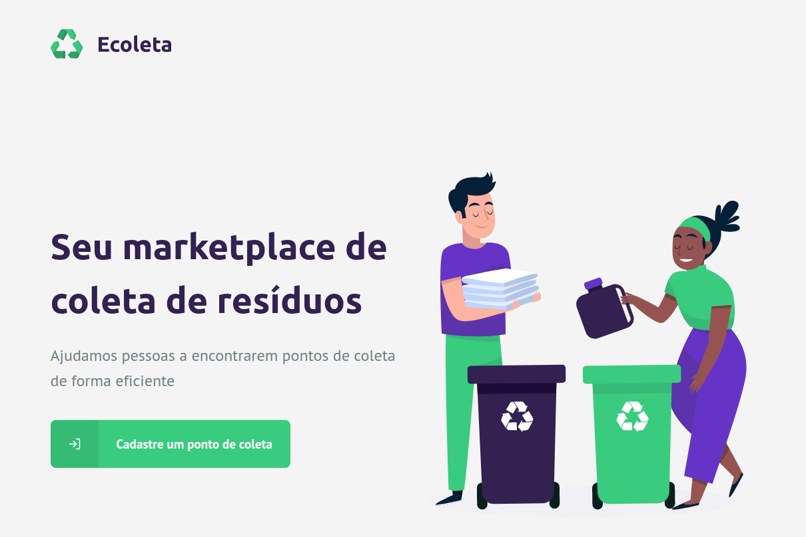

# Ecoleta

Projeto construído durante a Next Level Week oferecida pela [rocketseat]. As aplicações tem por objetivo permitir o cadastro e consulta de pontos de coleta de resíduos de forma eficiente e possuem a seguinte estrutura: 

  


  - API para o back-end;
  - Aplicação web para o front-end;
  - Aplicativo móvel para consulta dos dados;

## Tecnologias

 - API REST: (NodeJS, Express, Typescript, Knex, SQLite3);
 - Aplicação web: (ReactJS, Typescript, Axios, Leaflet, Dropzone);
 - Aplicação móvel: (React-Native, Expo, Axios);

## Instalação

Para execução das aplicações é necessário a instalação do [Node.js](https://nodejs.org/).
Instalar as dependencies e devDependencies para executar as aplicações.

### API
```sh
$ cd ecoletaapi
$ npm install
$ npm run dev
```

### Web
```sh
$ cd webecoleta
$ npm install
$ npm start
```

### APP
```sh
$ cd appecoleta
$ npm install
$ expo start
```

#### Portas
- API -> 3333
- Web -> 3000


   [rocketseat]: <https://rocketseat.com.br/>
   [nodejs]: <https://nodejs.org>